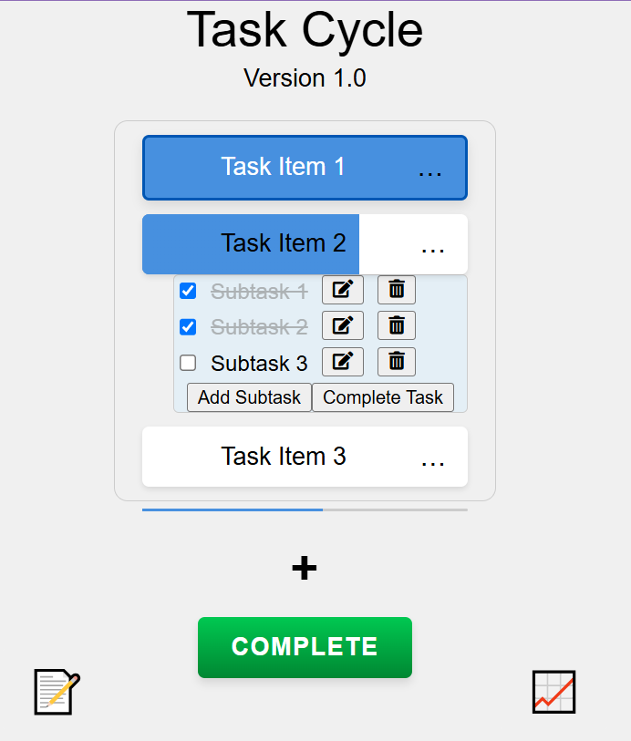
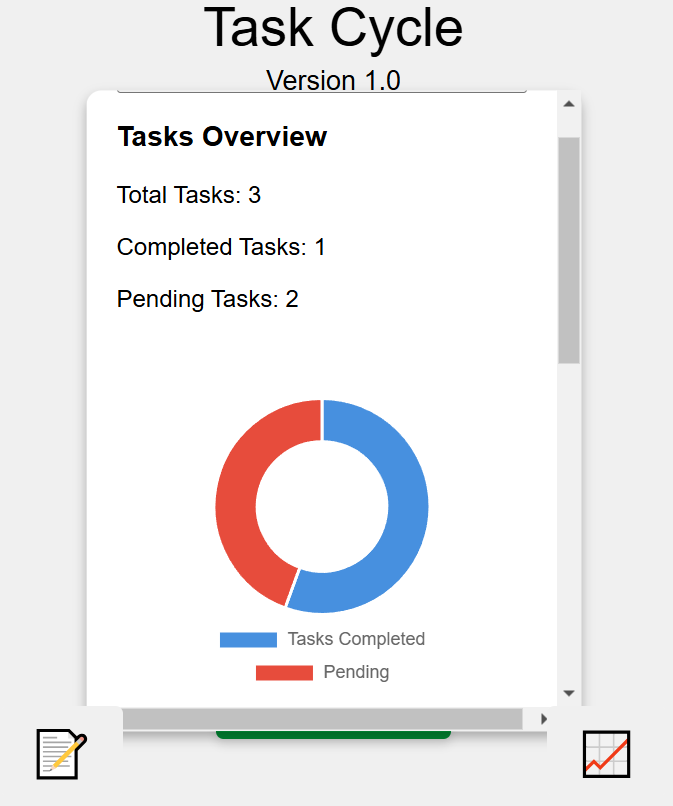
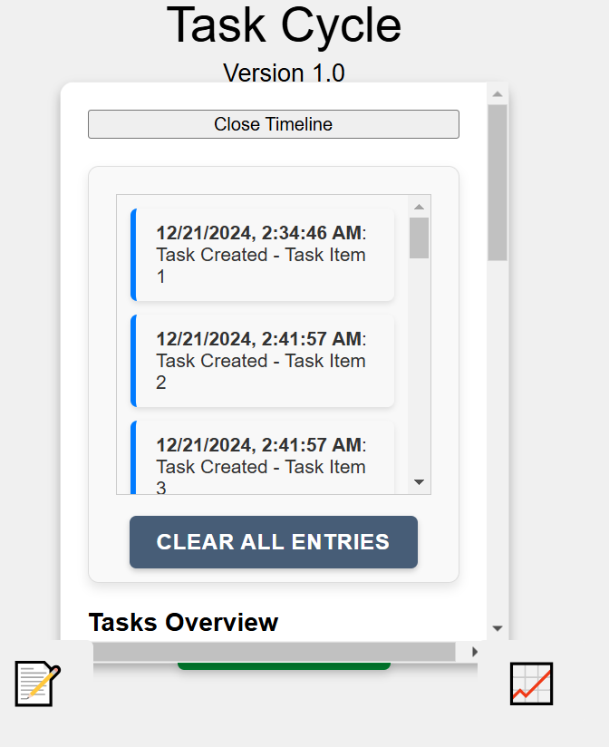

# Task Cycle

**Task Cycle** is a powerful productivity and workflow tool designed to streamline your daily routines through a unique auto-reset system. Whether you're managing projects, tracking job numbers, or building new habits, Task Cycle helps you stay on track with minimal friction.

---

## 🌟 Features

- ✅ **Task Cycle System** – Automatically resets your task list when all tasks are completed or when you click the "Complete" button.
- 🔁 **Recurring Tasks** – Flag specific tasks to recur only when appropriate settings are enabled.
- 📝 **Task and Subtask Support** – Break down tasks into subtasks and monitor progress visually.
- 🕒 **Stopwatch and Timer Modes** – Time yourself for focus sessions and track task duration.
- 📈 **Statistics Dashboard** – Visualize task completion trends and cycles completed.
- 🧠 **Timeline Logging** – Review task history and key workflow entries.
- 💾 **Save/Load Task Cycles** – Easily switch between different task workflows.
- 🎨 **Unlock Themes** – Earn new themes by completing cycles and hitting milestones.
- 🔒 **Offline First** – No account required. Your data stays local.

---

## 🧪 App Versions

### 🔹 miniCycle (Standalone App)
- **Free Forever** – Now available as a standalone app at [minicycle.app](https://minicycle.app)
- **Core Experience** – Includes the auto-reset system, visual progress, milestones, and themes.
- **Highly Polished** – Designed to feel like a paid app, even though it's free.
- **Formerly** – Was previously integrated as "Task Cycle: Mini" within this app.

### 🔸 Task Cycle (Full Version)
- **One-Time Purchase** – Try free for 30 days. Discount available near the end of trial.
- **Free Unlock Options**:
  - First 50 reviewers get full access free 🎁
  - Next 100 referrers unlock the app free 📣
- **Post-Trial**:
  - Users can still view saved Task Cycles but can’t save changes or create new ones.

### 🔒 Task Cycle: Pro (Coming Soon)
- **Planned for Future** – Currently not in development.
- **Features Will Include**:
  - Cloud Syncing
  - AI-Generated Task Templates
  - Team Collaboration
  - Advanced Analytics & Stats
- Buyers of Task Cycle will get **6 months of Pro access free**.

---

## 🧠 Design Philosophy

Task Cycle promotes:
- 🔁 Habit Formation through cycles and resets
- ✨ Simplicity over complexity
- 💼 Serious productivity tools for real-life workflows
- 🎮 Gamification through badges, milestones, and unlockable features

---

## 👨‍💻 Built by sparkinCreations

This app was created by a full-time inspector learning to code and dreaming of building a career in software. Task Cycle is the first step in that journey—combining real-world workflow needs with thoughtful design and delightful feedback.

Follow the story and other tools from **[sparkinCreations](https://sparkinCreations.com)**

---

## 🖼️ Screenshots

### **Task View**


### **Stats Panel**


### **Timeline**


---

## 🔧 Technology Stack

- **HTML5**: Markup for the app structure.
- **CSS3**: Styling for a clean and modern UI.
- **JavaScript**: Core functionality, including dynamic task management, timeline logging, and progress tracking.

---

## 💡 Why I Built This App

As a quality inspector, I often work with repetitive tasks and wanted a tool to help me:
- Ensure consistency in task completion.
- Track my efficiency and find ways to improve.
- Automate resets for recurring workflows.

This app started as a side project and became a learning experience in web development. It was built using my **basic coding knowledge** and assistance from tools like ChatGPT.

---

## 🗂 Folder Structure

```
📁 assets/
📁 data/
📁 scripts/
    📁 statsModal/
    📁 toolsModal/
    📄 builtInTools.js
    📄 main.js
    📄 main1.js
    📄 progressManager/
    📄 state.js
    📄 storageManager.js
    📄 taskManager.js
    📄 uiManager.js
📁 styles/
    📄 components.css
    📄 mobile.css
    📄 styles.css
📄 index.html
📄 README.md
📄 updates.md
```

---

## ⚙️ Running Locally

```bash
# Clone the repo
git clone https://github.com/SparkinTechProductions/TaskCycle.git

# Open index.html in your browser
```

---

## 🐛 Reporting Bugs

Found an issue or have a feature idea?  
Please [open an issue](https://github.com/SparkinTechProductions/TaskCycle/issues) or email: **admin@sparkincreations.com**

---

## 🙌 Thank You

Thanks for trying out Task Cycle! If it helps you build habits, stay productive, or enjoy completing your daily to-dos—please consider leaving a review or sharing it with a friend ❤️
